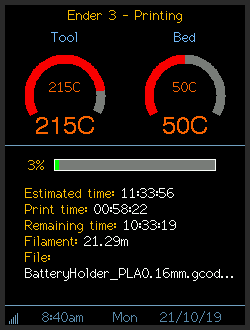

# Weather Station and OctoPrint Monitor

Another version of the popular ESP2866 weather station. Built using Visual Studio Code and PlatformIO.

## Features

* Creates an access point for connecting to any WiFi network.
* BME280 sensor for local temperature, pressure and humidity readings.
* 2.8" colour TFT for display. Should work with any size 320x240 display handled by the TFT library.
* Uses a cheap ESP8266 board as the controller.
* 4 different display modes. All display modes show WiFi strength, clock with date and time and use colourful icons.
  * Summary - indoor conditions, current weather and 3 day forecast.
  * 5 day forecast. 
  * Detailed current weather with indoor conditions.
  * OctoPrint monitor mode.
* All settings controlled through a web interface which also displays sensor readings and weather conditions.
* Uses OpenWeather API for current weather and forecasts. See note below.
* ThingSpeak integration - send sensor readings.
* MQTT - publishes sensor readings, subscribes to a control to switch display on and off.
* OctoPrint Monitor - monitor one 3D printer through OctoPrint
* Can perform screengrabs and send them to a Processing sketch over serial connection.
* Password protected OTA updates enabled through PlatformIO (not through web interface).

## OctoPrint Monitor project

See [3d-print-monitor](https://github.com/nospig/3d-print-monitor) for a project based on this weather station that can display up to 10 printers. It doesn't require the weather forecast API or a BME280 sensor.

## Example screens

## API

Uses the [OpenWeather](https://openweathermap.org/api) API for current conditions and daily forecast. I have access to the daily forecast call. Newly created OpenWeather accounts may not as it's now a paid feature. If there is any interest I can update the code to read the forecast from the available free API call.

## Libraries Used

* Adafruit BME280
* ArduinoJson
* ESPAsyncWiFiManager
* ESPAsyncTCP
* ESPAsyncWebServer
* TaskScheduler
* TFT_eSPI
* ThingSpeak
* AsyncMqttClient
* NTPClient

Big thanks to all library developers who make developing projects such as this simple.

## Hardware

Built using the following hardware from AliExpress.

[Wemos D1 mini ESP8266 board](https://www.aliexpress.com/item/32651747570.html)  
[2.8" TFT non touch version](https://www.aliexpress.com/item/33012793224.html)  
[BME280 sensor](https://www.aliexpress.com/item/32849462236.html)

Development was done on a NodeMCU board. Any TFT with a 320x240 display that works with the TFT_eSPI library should work but has not been tested.

## Wiring

    Mini RST -> TFT RST  
    Mini D0  -> TFT LED (for display brightness and on/off control, hope this is OK, just connect TFT LED to VCC if worried)
    Mini D5  -> TFT SCK  
    Mini D6  -> TFT MISO (only required if screen grab feature required)  
    Mini D7  -> TFT MOSI  
    Mini D8  -> TFT CS
    Mini D1  -> BME SCL  
    Mini D2  -> BME SDA  
    Mini D3  -> TFT DC  

Splice some wires and connect VCC on the TFT and BME to the Mini 3V3 pin. Do the same for GND to the Mini GND pin.

## Note

There is a setting in the TFT_eSPI library that has to be set the same as you wire the TFT to the Mini. With the above wiring no changes should be required.
Open User_Setup.h in the TFT_eSPI library folder and set the following to suit your build:

    // ###### EDIT THE PIN NUMBERS IN THE LINES FOLLOWING TO SUIT YOUR ESP8266 SETUP ######

    // For NodeMCU - use pin numbers in the form PIN_Dx where Dx is the NodeMCU pin designation
    #define TFT_CS   PIN_D8  // Chip select control pin D8
    #define TFT_DC   PIN_D3  // Data Command control pin
    #define TFT_RST  PIN_D4  // Reset pin (could connect to NodeMCU RST, see next line)
    //#define TFT_RST  -1    // Set TFT_RST to -1 if the display RESET is connected to NodeMCU RST or 3.3V

## UserSettings.h

Contains defines for MD5 password hash if you want to use OTA for future updates. The SCREEN_ROTATION define should be set depending on if you screen is pins up or pins down in it's case.

## OTA updates

Password protected OTA updates enabled. Set the MD5 hash of your prefered password in UserSettings.h. To upload via IP in PlatformIO create a file called uploadPassword.ini in the same folder as platformio.ini with the following contents:

    [password]
    upload_password = xxxxx
    
Replace xxxxx with the plain text version of your MD5 hash set above. [MD5 Generator.](https://www.miraclesalad.com/webtools/md5.php)

## MQTT

The station can publish sensor readings to a MQTT broker. Enter broker details on the MQTT settings page through the webserver. It will subscribe to the display topic, send 'on' and 'off' to control the display. Use packages such as Home Assistant, Node-Red, Influxdb and Grafana to graph local conditions.

## ThingSpeak

Sensor readings can be published to a ThingSpeak channel. Enable and set your ThingSpeak details in the ThingSpeak settings page.

## OctoPrint Monitor

OctoPrint monitor can monitor one 3D printer. Set up your OctoPrint host and API key on the OctoPrint Monitor settings page.

## Case

You can use any suitable 2.8" TFT D1 / NodeMCU case, many are available on ThingiVerse.
My case can be found [here.](https://www.thingiverse.com/thing:4279448)

## Thanks

[Weather icons](https://www.deviantart.com/umutavci/art/weather-icon-set-165476034) from umutavci.  
Inspired by [ThingPulse color weather station](https://github.com/ThingPulse/esp8266-weather-station-color) and [printer-monitor](https://github.com/Qrome/printer-monitor/tree/3.0).

